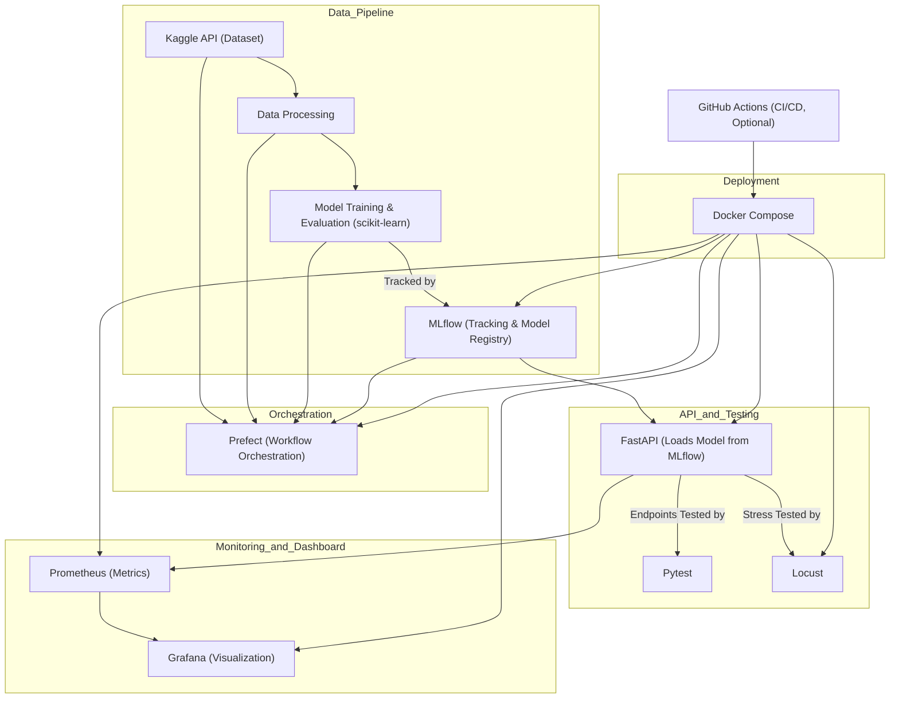

# News Classification MLOps

[](https://www.python.org/downloads/)
[](https://opensource.org/licenses/MIT)
[](https://mlops.org)

An end-to-end MLOps pipeline for training, deploying, and monitoring a news classification model using BBC articles dataset from Kaggle. This project demonstrates best practices in MLOps including model training, deployment, monitoring, and CI/CD.

## 🚀 Features

- **FastAPI Service**: Async API with multi-worker support and API key authentication
- **ML Pipeline**: Automated data processing, training, and evaluation using Prefect
- **Model Management**: Experiment tracking and model versioning with MLflow
- **Monitoring**: Real-time metrics and dashboards with Prometheus & Grafana
- **Testing**: Unit tests, integration tests, and load testing with Locust
- **Containerization**: Docker & Docker Compose
- **Orchestration**: Kubernetes
- **CI/CD**: Automated testing and deployment with GitHub Actions

## 🏗️ Project Structure

```
.
├── src/                  # Source code for the application
│   ├── api/              # FastAPI service implementation
│   │   └── templates/    # HTML templates for the API (if any)
│   ├── data/             # Data download and preprocessing scripts
│   ├── models/           # Model training, evaluation, and management
│   └── pipelines/        # Prefect workflow definitions
├── configs/              # Configuration files for services (Prometheus, Grafana, MLflow, etc.)
├── k8s/                  # Kubernetes manifests for deploying the stack
├── notebooks/            # Jupyter notebooks for data exploration and prototyping
├── tests/                # Unit, integration, and stress tests
├── data/                 # Data storage (raw, processed, and database files)
│   ├── raw/              # Raw datasets (e.g., BBC news data)
│   └── db/               # Database files (if any)
├── models/               # Saved and exported model artifacts
├── mlruns/               # MLflow experiment tracking data
├── logs/                 # Log files generated by services
├── images/               # Images for documentation and dashboards
├── docker-compose.yml    # Docker Compose configuration
├── Dockerfile            # Docker build file for the main application
├── requirements.txt      # Python dependencies
├── README.md             # Project documentation (this file)
└── LICENSE               # License file
```

**Key Points:**
- All core logic and pipelines are in `src/`.
- `configs/` holds service configs for monitoring, tracking, and orchestration.
- `k8s/` contains all-in-one Kubernetes manifests for easy cluster deployment.
- `notebooks/` is for exploration and prototyping.
- `tests/` covers both unit and stress/load testing.
- `images/` is used for documentation visuals and dashboard screenshots.
- Data, models, and logs are separated for clarity and reproducibility.

## 🚀 Getting Started

### 1. Clone and Setup

```bash
# Clone the repository
git clone https://github.com/faizan/A-to-Z-MLOps.git
cd A-to-Z-MLOps
```

### 2. Environment Configuration

1. Copy the example environment file:
   ```bash
   cp .env.example .env
   ```

2. Update `.env` with your configuration:
   ```env
   API_KEY=your_api_key
   CACHE_TTL=3600
   KAGGLE_USERNAME=your_kaggle_username
   KAGGLE_KEY=your_kaggle_api_key
   ```

> ⚠️ **Security Note**: Never commit your `.env` file to version control.


### 3. Docker Compose

```bash
# Start all services
docker-compose up -d
```

Available services:
- FastAPI: [http://localhost:7860/docs](http://localhost:7860/docs)
- Prometheus: [http://localhost:9090](http://localhost:9090)
- Grafana: [http://localhost:3000](http://localhost:3000) (admin/admin)
- MLflow: [http://localhost:5000](http://localhost:5000)
- Prefect: [http://localhost:4200](http://localhost:4200)
- Locust: [http://localhost:8089](http://localhost:8089)


```bash
# Stop all services
docker-compose down
```

## ☸️ Kubernetes Deployment

You can also deploy the entire stack on Kubernetes using the provided manifest. This is useful for running all services in a local or cloud Kubernetes cluster.

### Prerequisites
- Kubernetes cluster (e.g., Minikube, Docker Desktop, or any cloud provider)
- `kubectl` installed and configured

### Deploy All Services

```bash
kubectl apply -f k8s/all-in-one.yaml
```

### Accessing Services
All major dashboards and APIs are exposed via NodePort. Once deployed, access them in your browser at the following URLs:

| Service     | URL                          | Default Credentials         |
|-------------|------------------------------|----------------------------|
| API         | http://localhost:30760       | API key in `.env`/Config   |
| Grafana     | http://localhost:32000       | admin / admin              |
| Locust      | http://localhost:32089       | -                          |
| MLflow      | http://localhost:31500       | -                          |
| Prefect     | http://localhost:31200       | -                          |
| Prometheus  | http://localhost:30900       | -                          |

> If running on a remote cluster, replace `localhost` with your node's IP address.

To remove all resources:
```bash
kubectl delete -f k8s/all-in-one.yaml
```

## 🔧 Troubleshooting

1. **API Connection Issues**
   - Verify API key is correctly set in `.env`
   - Check if the service is running on the correct port
   - Ensure all required environment variables are set

2. **Docker Issues**
   - Ensure Docker daemon is running
   - Check port conflicts
   - Verify Docker Compose version compatibility

## 🛠️ Tech Stack

- **Package Management**: uv
- **Data Source**: Kaggle
- **Machine Learning**: scikit-learn
- **Model Management**: MLflow
- **Workflow Orchestration**: Prefect
- **API Framework**: FastAPI
- **Load Testing**: Locust
- **Monitoring**: Prometheus & Grafana
- **Containerization**: Docker & Docker Compose
- **Container Orchestration**: Kubernetes
- **CI/CD**: GitHub Actions

## 📝 Stats and Dashboards


### Project Strcuture
This project leverages a robust MLOps pipeline, integrating data ingestion, model training, evaluation, deployment, monitoring, and testing. The workflow is as follows:



### Prefect
Prefect orchestrates the workflow, running all steps in sequence and generating detailed logs for each stage.


### MLFlow

MLflow tracks all model training metrics and manages the model registry.


The trained model is registered in the MLflow Model Registry and loaded by the FastAPI application.


### Machine Learning Application
The FastAPI application exposes three endpoints: `/info`, `/predict`, and `/metrics`.


### Locust
Locust is used for stress testing the API, providing detailed statistics and real-time graphs of request performance.

Stress test graph to observe what happens at each second.


### Prometheus
Prometheus collects and displays system and application metrics, enabling real-time monitoring.


### Grafana
Grafana dashboards provide a comprehensive overview of the deployed model's performance and system health.


### Docker
Docker Desktop shows all running services and their respective ports, simplifying service management.
